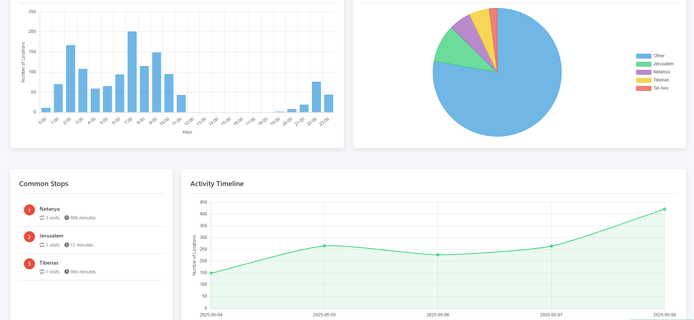
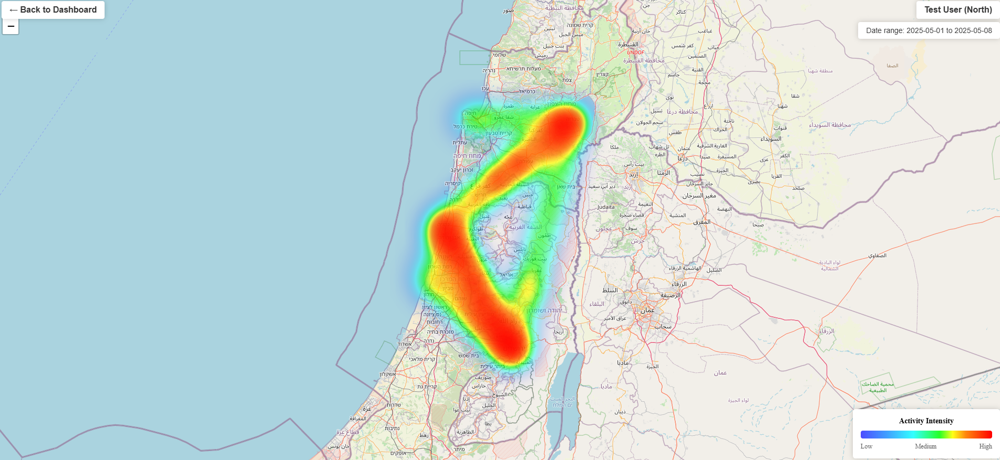
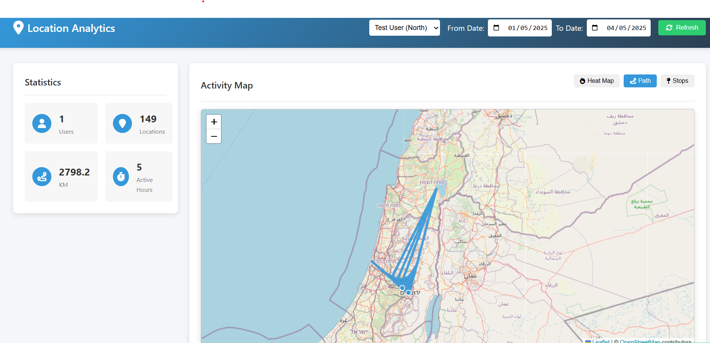
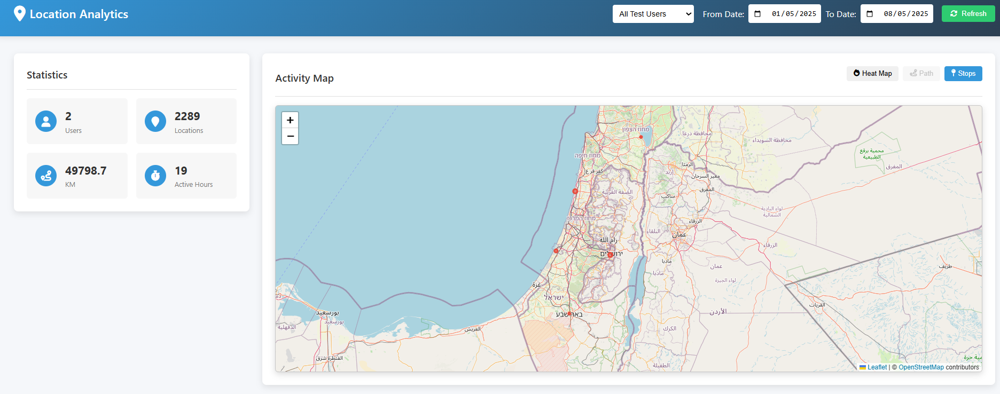

# Location Analytics SDK

A comprehensive location tracking and analytics solution that includes an Android SDK, backend server API, and analytics dashboard.

## Project Overview

The Location Analytics SDK provides developers with tools to track user location data in their Android applications, visualize movement patterns, and gain insights into user behavior. The project consists of three main components:

1. **Android SDK**: A library that Android developers can integrate into their apps to collect and transmit location data
2. **Backend API**: A Node.js/Express server that receives, processes, and stores location data
3. **Analytics Dashboard**: A web-based visualization tool for exploring collected location data

## Features

### Android SDK
- Easy integration with a builder pattern
- Automatic location tracking with customizable intervals
- Background tracking support
- Battery-efficient location collection
- Flexible user identification
- Automatic batching and retry mechanisms
- Real-time location queries
- User statistics retrieval

### Backend API
- RESTful API design
- Secure API key authentication
- Batch location data processing
- User statistics calculation
- Efficient MongoDB data storage
- Scalable architecture

### Analytics Dashboard
- Interactive heatmap visualization
- Path tracking visualization
- Common stops detection and display
- Activity hours analysis
- Visit frequency by location
- Timeline visualization
- Filter by date range and user
- Responsive design

## Dashboard Screenshots

### Analytics Overview

*Dashboard showing activity hours, city visits, common stops, and timeline analytics*

### Heatmap Visualization

*Heatmap showing user movement patterns across Israel with activity intensity*

### Path Tracking

*Path tracking visualization showing user movement between locations*

### Stops Analysis

*Stops visualization showing frequently visited locations across Israel with the main statistics panel*

The system follows a client-server architecture:

1. **Android SDK** (Client):
   - Collects location data from device GPS
   - Batches data for efficient transmission
   - Communicates with backend via REST API
   - Provides local statistics and current location

2. **Backend Server** (Server):
   - Receives location data from SDK clients
   - Stores data in MongoDB (user collections)
   - Processes data for statistical analysis
   - Provides API endpoints for data retrieval
   - Serves the analytics dashboard

3. **Analytics Dashboard** (UI):
   - Visualizes location data using Leaflet maps
   - Displays statistical insights with Chart.js
   - Provides filtering and exploration tools
   - Responsive web interface

## Getting Started

### Prerequisites
- Android Studio 4.0+ (for SDK development)
- Node.js 14+ (for backend server)
- MongoDB database (local or Atlas)
- Modern web browser (for dashboard)

### Android SDK Integration

1. Add the SDK to your project:

```gradle
dependencies {
    implementation 'com.example:locationanalyticssdk:1.0.0'
}
```

2. Initialize the SDK in your application:

```java
LocationAnalyticsSDK sdk = new LocationAnalyticsSDK.Builder(context)
    .setServerUrl("https://your-server-url.com/")
    .setApiKey("your_api_key")
    .setTrackingInterval(600000) // 10 minutes
    .build();

// Set user identifier
sdk.setUserIdentifier(userId);
```

3. Request permissions and start tracking:

```java
// Check for permissions
if (!sdk.hasLocationPermission()) {
    sdk.requestPermissions(this);
} else {
    // Start location tracking
    sdk.startTracking();
}
```

4. Handle permission results:

```java
@Override
public void onRequestPermissionsResult(int requestCode, @NonNull String[] permissions, @NonNull int[] grantResults) {
    super.onRequestPermissionsResult(requestCode, permissions, grantResults);
    if (requestCode == LocationAnalyticsSDK.LOCATION_PERMISSION_REQUEST_CODE) {
        if (grantResults.length > 0 && grantResults[0] == PackageManager.PERMISSION_GRANTED) {
            // Start tracking after permission granted
            sdk.startTracking();
        }
    }
}
```

### Server Setup

1. Clone the repository
2. Install dependencies:
   ```
   cd Server
   npm install
   ```
3. Create a `.env` file with:
   ```
   PORT=your_port
   MONGODB_URI=your_mongodb_connection_string
   API_KEY=your_api_key
   SERVER_URL=your_server_url
   ```
4. Start the server:
   ```
   npm start
   ```

### Dashboard Access

The dashboard is served by the server at the root URL.

## Documentation

For complete documentation, see the [docs folder](DOCS.md).

## API Reference

| Endpoint | Method | Description |
|----------|--------|-------------|
| `/api/location/batch` | POST | Send batch of locations |
| `/api/locations` | GET | Get locations by user ID and time range |
| `/api/users` | GET | Get all users |
| `/api/user/statistics` | GET | Get user statistics |

## SDK Reference

| Method | Description |
|--------|-------------|
| `setUserIdentifier(String userId)` | Sets the user identifier |
| `hasLocationPermission()` | Checks if location permissions are granted |
| `requestPermissions(Activity activity)` | Requests location permissions |
| `setTrackingInterval(int milliseconds)` | Sets the tracking interval |
| `startTracking()` | Starts location tracking |
| `stopTracking()` | Stops location tracking |
| `isTracking()` | Returns tracking status |
| `getCurrentLocation(LocationCallback callback)` | Gets current location |
| `getUserStatistics(ApiCallback<UserStatistics> callback)` | Gets user statistics |

## Deployment

### Server Deployment
The server can be deployed to platforms like Render, Heroku, or any other Node.js hosting service:

1. Connect your GitHub repository to the hosting service
2. Configure environment variables (MONGODB_URI, API_KEY, etc.)
3. Deploy the application

### Dashboard Deployment
The dashboard is served by the server and doesn't require separate deployment.

## Contributing

1. Fork the repository
2. Create your feature branch (`git checkout -b feature/amazing-feature`)
3. Commit your changes (`git commit -m 'Add some amazing feature'`)
4. Push to the branch (`git push origin feature/amazing-feature`)
5. Open a Pull Request

## License

This project is licensed under the MIT License - see the [LICENSE](LICENSE) file for details.

## Acknowledgments

- [Leaflet](https://leafletjs.com/) for map visualization
- [Chart.js](https://www.chartjs.org/) for statistical charts
- [Express](https://expressjs.com/) for the backend server
- [MongoDB](https://www.mongodb.com/) for database storage
